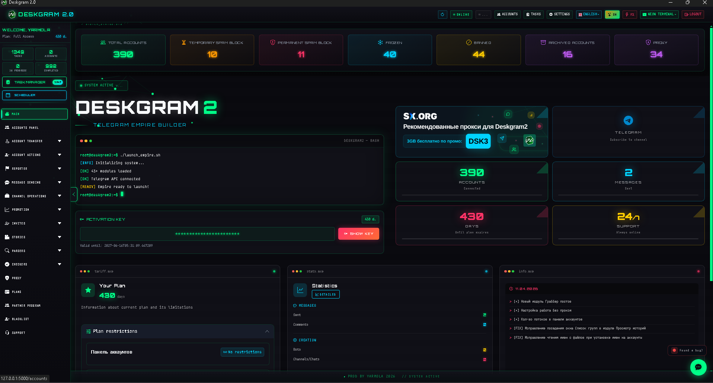
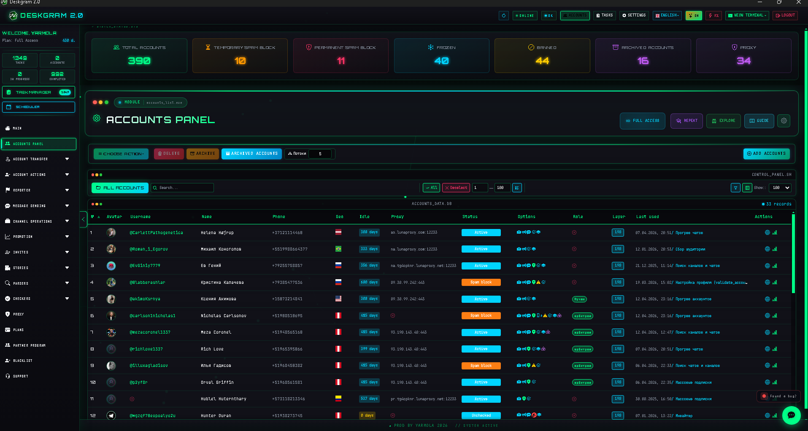
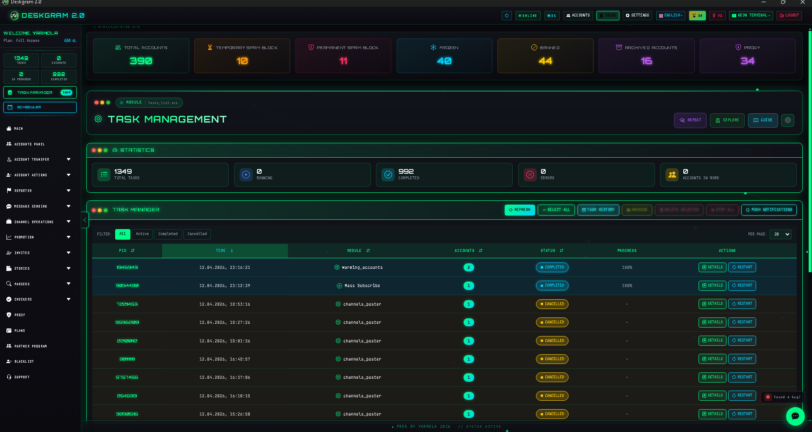
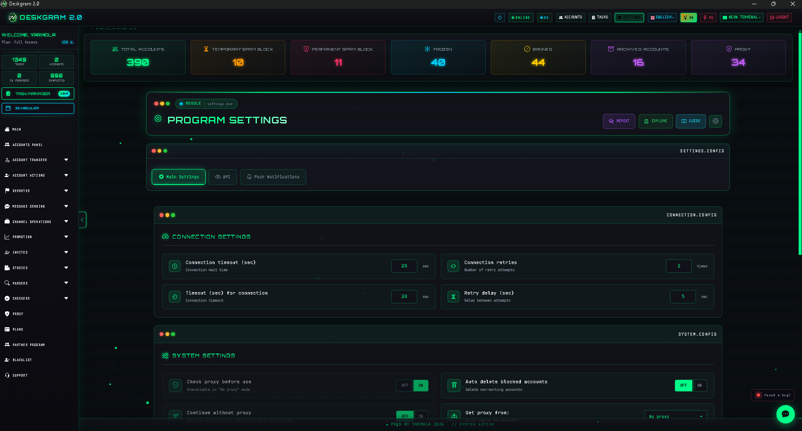

# Deskgram 2 for Telegram Automation

Deskgram 2 is a Telegram automation platform for account management, outreach workflows, AI modules, audience parsing, invite scenarios, and infrastructure setup. This repository acts as the English-language hub and points to more focused repositories for specific use cases.

[Official Website](https://deskgram2.com/) · [Telegram Bot](https://t.me/DG2welcomebot) · [Web Preview](https://deskgram2.com/web-preview) · [Advantages](https://deskgram2.com/advantages)
## Interactive Web Preview

Try the module interface in the browser: [Open web preview](https://deskgram2.com/web-preview?path=%2Fapp-demo%2Fhome)

## Why it is useful

| Manual work | What Deskgram 2 gives you |
|---|---|
| Managing separate tools and repetitive steps | One interface for multiple Telegram workflows |
| Tracking accounts, proxies, and limits in different places | Centralized infrastructure management |
| Splitting outreach, parsing, and AI tasks across spreadsheets and tools | A unified workflow layer inside one system |
| Losing task history and execution context | Built-in logs, statistics, and task monitoring |
| Struggling to scale operations | Multi-threaded execution with visible control over limits |

## What you can automate

| Scenario | Recommended modules | Outcome |
|---|---|---|
| AI commenting on new posts | Neuro Commenting | Automated comment activity for Telegram channels |
| Direct messaging campaigns | Direct Messaging | Personal outreach flows with limits, AI, and follow-up options |
| Audience collection and segmentation | Audience Parser | Exportable Telegram user base for the next steps |
| Infrastructure preparation | Accounts, Proxy, Settings, Join Groups | A ready operational layer for broader workflows |

## Who this is for

- Telegram marketing teams
- channel owners and account operators
- lead generation specialists
- teams combining AI and outreach in one workflow
- users who want one system instead of fragmented scripts and tools

## Visual overview

## Execution guides

- [Neuro Commenting](https://github.com/Deskgram-2/telegram-neuro-commenting-deskgram-en)
- [Direct Messaging](https://github.com/Deskgram-2/telegram-direct-messaging-deskgram-en)
- [Audience Parser](https://github.com/Deskgram-2/telegram-audience-parser-deskgram-en)
- [Join Groups](https://github.com/Deskgram-2/telegram-join-groups-deskgram-en)

## Discovery guides

- [Channel and Group Search](https://github.com/Deskgram-2/telegram-channel-search-deskgram-en)
- [Similar Channels](https://github.com/Deskgram-2/telegram-similar-channels-deskgram-en)
- [Comment Audience Parser](https://github.com/Deskgram-2/telegram-comment-audience-parser-deskgram-en)
- [Active Chat Users Parser](https://github.com/Deskgram-2/telegram-active-chat-users-parser-deskgram-en)

## Infrastructure and control guides

- [Invite Tool](https://github.com/Deskgram-2/telegram-invite-tool-deskgram-en)
- [Proxy Manager](https://github.com/Deskgram-2/telegram-proxy-manager-deskgram-en)
- [Account Manager](https://github.com/Deskgram-2/telegram-account-manager-deskgram-en)
- [Task Manager](https://github.com/Deskgram-2/telegram-task-manager-deskgram-en)
- [Automation Settings](https://github.com/Deskgram-2/telegram-automation-settings-deskgram-en)

## How the published English repos connect together

- [Account Manager](https://github.com/Deskgram-2/telegram-account-manager-deskgram-en) -> [Proxy Manager](https://github.com/Deskgram-2/telegram-proxy-manager-deskgram-en) -> [Automation Settings](https://github.com/Deskgram-2/telegram-automation-settings-deskgram-en) builds the base layer.
- [Audience Parser](https://github.com/Deskgram-2/telegram-audience-parser-deskgram-en) -> [Direct Messaging](https://github.com/Deskgram-2/telegram-direct-messaging-deskgram-en) is the main outreach route.
- [Channel and Group Search](https://github.com/Deskgram-2/telegram-channel-search-deskgram-en) -> [Similar Channels](https://github.com/Deskgram-2/telegram-similar-channels-deskgram-en) -> [Audience Parser](https://github.com/Deskgram-2/telegram-audience-parser-deskgram-en) is the clearest localized discovery route.
- [Join Groups](https://github.com/Deskgram-2/telegram-join-groups-deskgram-en) -> [Invite Tool](https://github.com/Deskgram-2/telegram-invite-tool-deskgram-en) supports growth and environment preparation.
- [Automation Settings](https://github.com/Deskgram-2/telegram-automation-settings-deskgram-en) -> [Neuro Commenting](https://github.com/Deskgram-2/telegram-neuro-commenting-deskgram-en) -> [Task Manager](https://github.com/Deskgram-2/telegram-task-manager-deskgram-en) is the clearest AI-like execution + control chain inside the current EN wave.

## Suggested workflow chains

- [Account Manager](https://github.com/Deskgram-2/telegram-account-manager-deskgram-en) -> [Proxy Manager](https://github.com/Deskgram-2/telegram-proxy-manager-deskgram-en) -> [Automation Settings](https://github.com/Deskgram-2/telegram-automation-settings-deskgram-en) -> [Audience Parser](https://github.com/Deskgram-2/telegram-audience-parser-deskgram-en) -> [Direct Messaging](https://github.com/Deskgram-2/telegram-direct-messaging-deskgram-en)
- [Channel and Group Search](https://github.com/Deskgram-2/telegram-channel-search-deskgram-en) -> [Similar Channels](https://github.com/Deskgram-2/telegram-similar-channels-deskgram-en) -> [Comment Audience Parser](https://github.com/Deskgram-2/telegram-comment-audience-parser-deskgram-en) -> [Direct Messaging](https://github.com/Deskgram-2/telegram-direct-messaging-deskgram-en)
- [Channel and Group Search](https://github.com/Deskgram-2/telegram-channel-search-deskgram-en) -> [Active Chat Users Parser](https://github.com/Deskgram-2/telegram-active-chat-users-parser-deskgram-en) -> [Invite Tool](https://github.com/Deskgram-2/telegram-invite-tool-deskgram-en)
- [Account Manager](https://github.com/Deskgram-2/telegram-account-manager-deskgram-en) -> [Join Groups](https://github.com/Deskgram-2/telegram-join-groups-deskgram-en) -> [Invite Tool](https://github.com/Deskgram-2/telegram-invite-tool-deskgram-en)
- [Automation Settings](https://github.com/Deskgram-2/telegram-automation-settings-deskgram-en) -> [Neuro Commenting](https://github.com/Deskgram-2/telegram-neuro-commenting-deskgram-en) -> [Task Manager](https://github.com/Deskgram-2/telegram-task-manager-deskgram-en)
- [Audience Parser](https://github.com/Deskgram-2/telegram-audience-parser-deskgram-en) -> [Invite Tool](https://github.com/Deskgram-2/telegram-invite-tool-deskgram-en) -> [Task Manager](https://github.com/Deskgram-2/telegram-task-manager-deskgram-en)
- [Account Manager](https://github.com/Deskgram-2/telegram-account-manager-deskgram-en) -> [Join Groups](https://github.com/Deskgram-2/telegram-join-groups-deskgram-en) -> [Audience Parser](https://github.com/Deskgram-2/telegram-audience-parser-deskgram-en) -> [Direct Messaging](https://github.com/Deskgram-2/telegram-direct-messaging-deskgram-en)

## What to choose for the first real outcome

| If you want the first practical outcome to be | Better route |
|---|---|
| A usable audience base and private outreach | [Audience Parser](https://github.com/Deskgram-2/telegram-audience-parser-deskgram-en) -> [Direct Messaging](https://github.com/Deskgram-2/telegram-direct-messaging-deskgram-en) |
| A discovery-first route from source research into warm parsing | [Channel and Group Search](https://github.com/Deskgram-2/telegram-channel-search-deskgram-en) -> [Similar Channels](https://github.com/Deskgram-2/telegram-similar-channels-deskgram-en) -> [Comment Audience Parser](https://github.com/Deskgram-2/telegram-comment-audience-parser-deskgram-en) |
| Community growth through environment preparation | [Join Groups](https://github.com/Deskgram-2/telegram-join-groups-deskgram-en) -> [Invite Tool](https://github.com/Deskgram-2/telegram-invite-tool-deskgram-en) |
| AI-driven post engagement | [Automation Settings](https://github.com/Deskgram-2/telegram-automation-settings-deskgram-en) -> [Neuro Commenting](https://github.com/Deskgram-2/telegram-neuro-commenting-deskgram-en) |
| Infrastructure readiness before any campaign starts | [Account Manager](https://github.com/Deskgram-2/telegram-account-manager-deskgram-en) -> [Proxy Manager](https://github.com/Deskgram-2/telegram-proxy-manager-deskgram-en) -> [Automation Settings](https://github.com/Deskgram-2/telegram-automation-settings-deskgram-en) |

## Quick start

1. Add Telegram accounts to the system.
2. Configure proxies if your workflow needs them.
3. Connect AI providers and system settings.
4. Pick the module that matches your scenario.
5. Set limits, delays, and filters.
6. Run the task and monitor logs and results.

## Suggested path

1. [Account Manager](https://github.com/Deskgram-2/telegram-account-manager-deskgram-en) to prepare the account base.
2. [Proxy Manager](https://github.com/Deskgram-2/telegram-proxy-manager-deskgram-en) and [Automation Settings](https://github.com/Deskgram-2/telegram-automation-settings-deskgram-en) to build the working environment.
3. [Audience Parser](https://github.com/Deskgram-2/telegram-audience-parser-deskgram-en) or [Join Groups](https://github.com/Deskgram-2/telegram-join-groups-deskgram-en) to prepare the source base and infrastructure.
4. [Direct Messaging](https://github.com/Deskgram-2/telegram-direct-messaging-deskgram-en), [Invite Tool](https://github.com/Deskgram-2/telegram-invite-tool-deskgram-en), or [Neuro Commenting](https://github.com/Deskgram-2/telegram-neuro-commenting-deskgram-en) for execution.
5. [Task Manager](https://github.com/Deskgram-2/telegram-task-manager-deskgram-en) to monitor the workflow.

## FAQ

### Is this one module or a full system?

It is a system of multiple modules. This repository is the hub that explains the platform and routes you to narrower guides.

### Does Deskgram 2 include AI workflows?

Yes. AI is already part of multiple modules and settings, including commenting, messaging, and reply generation.

### What is inside this repository?

This is an overview entry point for Deskgram 2 with links to more focused module repositories.

## FAQ for getting started

### Where should I start if I do not have a user base yet?

Usually the best route is to prepare accounts and infrastructure first, then decide between [Audience Parser](https://github.com/Deskgram-2/telegram-audience-parser-deskgram-en) and [Join Groups](https://github.com/Deskgram-2/telegram-join-groups-deskgram-en) depending on whether you need users first or an environment layer first.

### Which route usually gives the fastest first result?

The clearest first result usually comes from [Audience Parser](https://github.com/Deskgram-2/telegram-audience-parser-deskgram-en) -> [Direct Messaging](https://github.com/Deskgram-2/telegram-direct-messaging-deskgram-en), because it turns a prepared base into a measurable outreach scenario quickly.

### Is Deskgram 2 still useful without AI?

Yes. AI is only one part of the platform. Infrastructure, parsing, invite, joining, and regular messaging workflows are still useful without AI-enabled routes.
